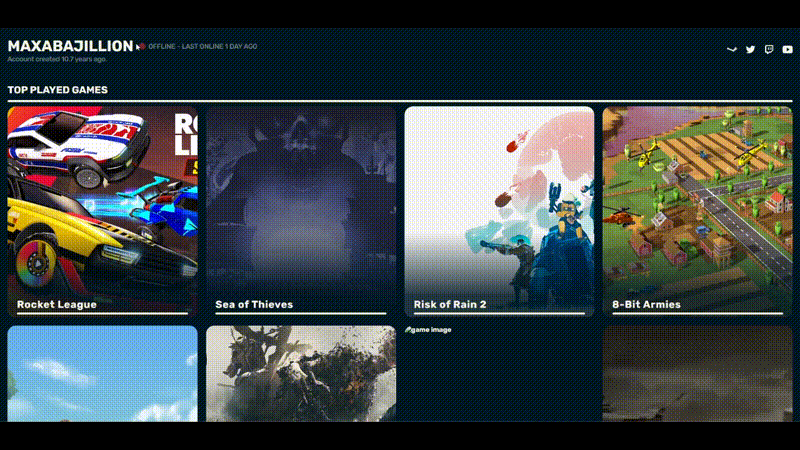

# Gamer

## Introduction

The World Class Gamer project is a website that was aimed at testing out [Firebase Functions](https://firebase.google.com/docs/functions/) and getting familiar with api's through the [SteamAPI](https://developer.valvesoftware.com/wiki/Steam_Web_API#).

_This project has since been taken offline due to financial resons._

## Features

-   Integration with SteamAPI to retrieve data about the user's Steam profile
-   Use of Firebase Functions to handle API calls and retrieve data from SteamAPI
-   Frontend implementation to display the retrieved data from SteamAPI

## Example



### I used api calls for:

-   game background pictures
-   game descriptions / names
-   profile name
-   profile online status
-   profile creation date

## Usage

I send the function I want to firebase using something like this

```js
exports.getGameInfo = functions.https.onRequest((req, res) => {
    const gameId = req.query.gameId;

    requestData(`https://store.steampowered.com/api/appdetails?appids=${gameId}&key=${API_KEY}`, req, res);
});

exports.getUserGameData = functions.https.onRequest((req, res) => {
    const gameId = req.query.gameId;

    requestData(
        `http://api.steampowered.com/ISteamUserStats/GetUserStatsForGame/v0002/?appid=${gameId}&key=${API_KEY}&steamid=${PROFILE_ID}`,
        req,
        res
    );
});
```

and then deploy those functions using

```
firebase deploy --only "functions,hosting"
```
